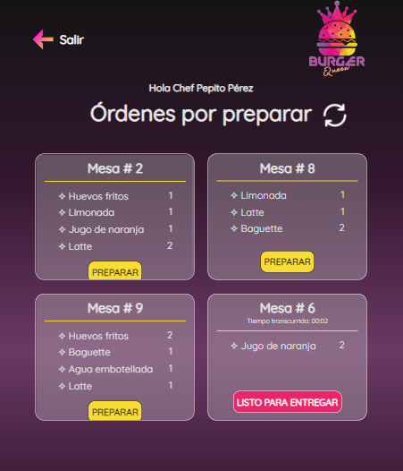
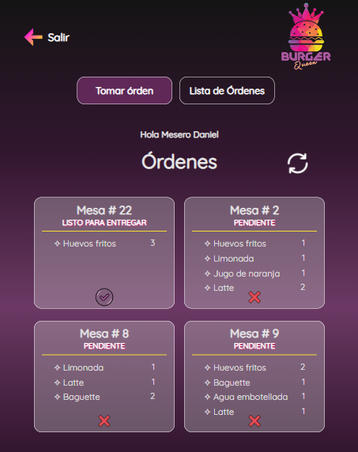
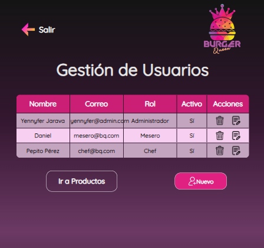
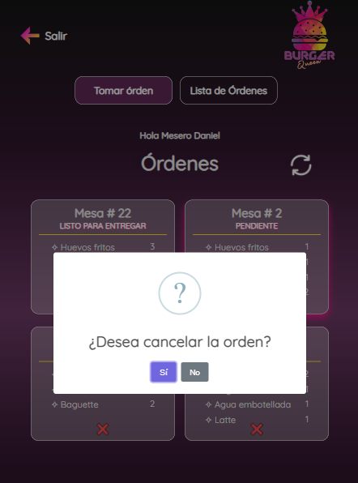
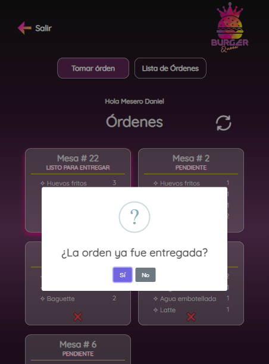

# Burguen Queen - Client

  

¡Bienvenido a Burguen Queen, el innovador sistema de gestión de pedidos diseñado especialmente para hamburgueserías en crecimiento! Este proyecto se enfoca en el desarrollo del frontend de la aplicación, brindando una solución eficiente y una experiencia de usuario de primera categoría.

## Características principales

- **Interfaz de usuario intuitiva**:  Nuestra aplicación ofrece una interfaz de usuario intuitiva que permite a los empleados tomar pedidos de manera eficiente y sin complicaciones.

- **Gestión de pedidos en tiempo real**: No solo facilita la toma de pedidos, sino que también empodera al administrador para gestionar usuarios y productos mediante operaciones CRUD (Crear, Editar, Actualizar y Eliminar).

- **Diseño personalizado**: Hemos cuidadosamente diseñado la interfaz para garantizar que se adapte perfectamente a las necesidades de la hamburguesería, proporcionando un aspecto atractivo y profesional.

- **Integración de API**:  La aplicación se integra sin esfuerzo con el backend a través de una API personalizada, asegurando un rendimiento óptimo y una administración eficiente.

## Tecnologías Utilizadas

<table>
  <tr>
    <td align="center">
      
    </td>
    <td align="center">
      
    </td>
    <td align="center">
      
    </td>
    <td align="center">
      
    </td>
    <td align="center">
      
    </td>
    <td align="center">
      
    </td>
    <td align="center">
      
    </td>
  </tr>
</table>

- **React**: Hemos construido la interfaz de usuario utilizando React, una biblioteca de JavaScript ampliamente utilizada para crear interfaces de usuario interactivas y eficientes.

- **Fetch API**: Utilizamos la Fetch API de JavaScript para la comunicación con el backend, lo que nos permite realizar solicitudes HTTP de manera nativa en el navegador.

- **CSS Modules**: Para mantener los estilos de manera organizada y evitar conflictos, hemos implementado CSS Modules en nuestra aplicación.

- **API Personalizada**: Hemos desarrollado una API personalizada que conecta el frontend con el backend, permitiendo una comunicación eficiente y segura.

- **SweetAlert2**: Para crear pop-ups y alertas atractivas, utilizamos la librería SweetAlert2.

## Historias de Usuario

### [Historia de Usuario 1] Mesero/a debe poder ingresar al sistema, si el admin ya le ha asignado credenciales

#### Descripción

Como mesero/a, quiero poder ingresar al sistema de pedidos.

**Criterios de Aceptación:**
- Acceder a una pantalla de inicio de sesión.
- Ingresar email y contraseña.
- Recibir mensajes de error comprensibles según la información ingresada.
- Ingresar al sistema de pedidos si las credenciales son correctas.

**Captura de Pantalla:**

---

### [Historia de Usuario 2] Mesero/a debe poder tomar pedido de cliente/a

#### Descripción

Como mesero/a, quiero tomar el pedido de un/a cliente/a para no depender de mi mala memoria, saber cuánto cobrar y enviarlo a la cocina para evitar errores y preparar en orden.

**Criterios de Aceptación:**
- Anotar el nombre del/a cliente/a.
- Agregar productos al pedido.
- Eliminar productos.
- Ver resumen y el total de la compra.
- Enviar pedido.

**Captura de Pantalla:**

---

### [Historia de Usuario 3] Jefe de cocina debe ver los pedidos

#### Descripción

Como jefe de cocina, quiero ver los pedidos de los clientes en orden y marcar cuáles están listos para saber qué se debe cocinar y avisar a los meseros que un pedido está listo para servirlo a un cliente.

**Criterios de Aceptación:**
- Ver los pedidos ordenados según se van haciendo.
- Marcar los pedidos que se han preparado y están listos para servirse.
- **Tiempo de Preparación (En desarrollo):**
   - Actualmente, estamos trabajando en la implementación del cálculo y visualización del tiempo que tomó preparar cada pedido desde que llegó hasta que se marcó como completado. Esta función se encuentra en proceso de desarrollo.

**Capturas de Pantalla:**
- Interfaz del Chef: 

---

### [Historia de Usuario 4] Mesero/a debe ver pedidos listos para servir

#### Descripción

Como mesero/a, quiero ver los pedidos que están preparados para entregarlos rápidamente a los clientes que las hicieron.

**Criterios de Aceptación:**
- Ver listado de pedidos listos para servir.
- Marcar pedidos que han sido entregados.

**Captura de Pantallas:**
- Estado de Órdenes: 

---

### [Historia de Usuario 5] Administrador(a) de tienda debe administrar a sus trabajadorxs

#### Descripción

Como administrador(a) de tienda, quiero gestionar a los usuarios de la plataforma para mantener actualizada la información de mis trabajadorxs.

**Criterios de Aceptación:**
- Ver un listado de trabajadorxs.
- Agregar nuevos trabajadorxs.
- Eliminar trabajadorxs existentes.
- Actualizar datos de trabajadorxs.

**Captura de Pantalla:**
- Listado de Trabajadores: 

---

### [Historia de Usuario 6] Administrador(a) de tienda debe administrar a sus productos

#### Descripción

Como administrador(a) de tienda, quiero gestionar los productos para mantener actualizado el menú.

**Criterios de Aceptación:**
- Ver un listado de productos.
- Agregar nuevos productos al menú.
- Eliminar productos del menú.
- Actualizar datos de productos existentes.

**Captura de Pantalla:**
- Listado de Productos: 

**Pop-Ups en la Aplicación:**

1. **Pop-Up de Confirmación de Pedido:**
   - Muestra el pop-up de confirmación que aparece después de realizar un pedido exitosamente.

   

2. **Pop-Up de Cancelación de Orden:**
   - Se presenta cuando el cliente decide cancelar la orden, proporcionando una confirmación para garantizar la precisión de la acción.

   

3. **Pop-Up de Confirmación de Entrega:**
   - Aparece para confirmar si la orden ha sido entregada satisfactoriamente al cliente, brindando un cierre claro al proceso de servicio.

   

## Estado del Proyecto

**En Desarrollo:**
El proyecto está actualmente en fase de desarrollo y se están abordando las siguientes tareas:

- Desarrollo de nuevas funcionalidades y mejoras.
- Resolución de los issues creados en el repositorio de Git.

Puedes encontrar detalles específicos sobre cada tarea en nuestro [repositorio de Git](https://github.com/Yennyferjp/Burger-Queen-App/issues).

