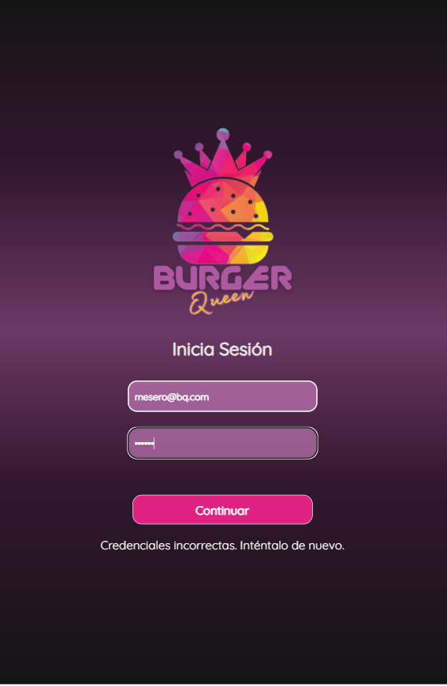
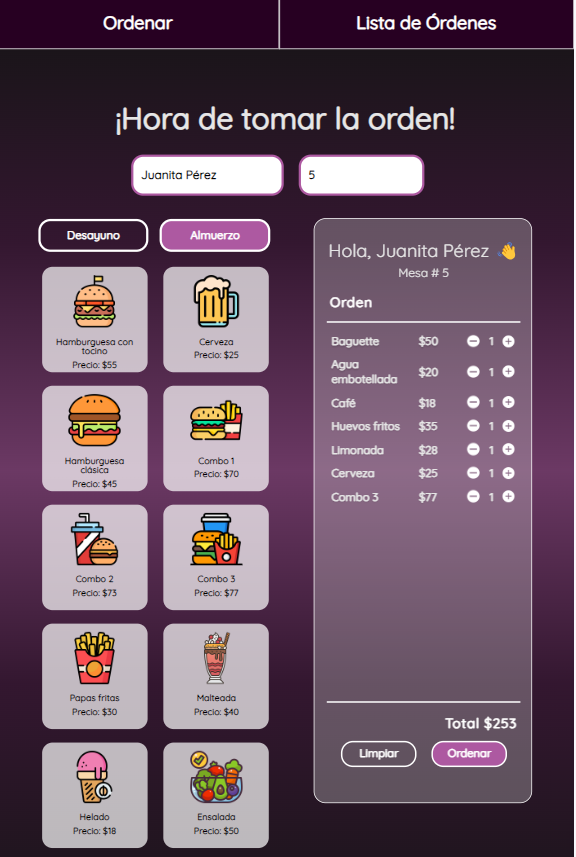
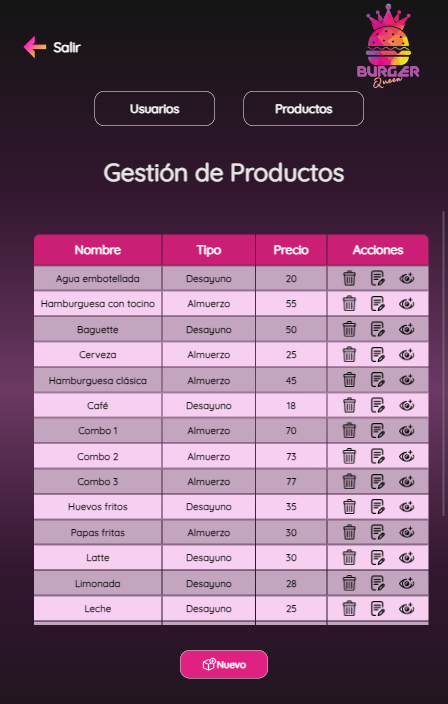
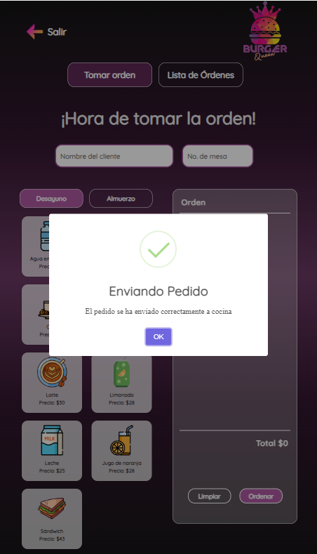
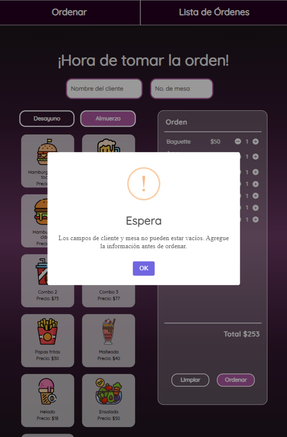

# Burguen Queen - Client

  

¡Bienvenido a Burguen Queen, el innovador sistema de gestión de pedidos diseñado especialmente para hamburgueserías en crecimiento! Este proyecto se enfoca en el desarrollo del frontend de la aplicación, brindando una solución eficiente y una experiencia de usuario de primera categoría.

## Características principales

- **Interfaz de usuario intuitiva**:  Nuestra aplicación ofrece una interfaz de usuario intuitiva que permite a los empleados tomar pedidos de manera eficiente y sin complicaciones.

- **Gestión de pedidos en tiempo real**: No solo facilita la toma de pedidos, sino que también empodera al administrador para gestionar usuarios y productos mediante operaciones CRUD (Crear, Editar, Actualizar y Eliminar).

- **Diseño personalizado**: Hemos cuidadosamente diseñado la interfaz para garantizar que se adapte perfectamente a las necesidades de la hamburguesería, proporcionando un aspecto atractivo y profesional.

- **Integración de API**:  La aplicación se integra sin esfuerzo con el backend a través de una API personalizada, asegurando un rendimiento óptimo y una administración eficiente.

## Tecnologías Utilizadas

<table>
  <tr>
    <td align="center">
      
    </td>
    <td align="center">
      
    </td>
    <td align="center">
      
    </td>
    <td align="center">
      
    </td>
    <td align="center">
      
    </td>
    <td align="center">
      
    </td>
    <td align="center">
      
    </td>
  </tr>
</table>

- **React**: Hemos construido la interfaz de usuario utilizando React, una biblioteca de JavaScript ampliamente utilizada para crear interfaces de usuario interactivas y eficientes.

- **Fetch API**: Utilizamos la Fetch API de JavaScript para la comunicación con el backend, lo que nos permite realizar solicitudes HTTP de manera nativa en el navegador.

- **CSS Modules**: Para mantener los estilos de manera organizada y evitar conflictos, hemos implementado CSS Modules en nuestra aplicación.

- **API Personalizada**: Hemos desarrollado una API personalizada que conecta el frontend con el backend, permitiendo una comunicación eficiente y segura.

- **SweetAlert2**: Para crear pop-ups y alertas atractivas, utilizamos la librería SweetAlert2.

## Capturas de Pantalla

**Inicio de Sesión:**
- Muestra la página de inicio de la aplicación, que incluye el formulario de inicio de sesión para los usuarios autorizados.

**Proceso de Toma de Pedido:**
- Ilustra cómo los empleados toman pedidos de manera eficiente y seleccionan elementos del menú.

**Gestión de Trabajadores:**
- Muestra la interfaz para administrar usuarios, lo que incluye crear, editar y eliminar productos.

**Menú de Productos:**
- Muestra la variedad de productos disponibles en la aplicación, con opciones de personalización.

**Pop-Up de Confirmación:**
- Muestra el pop-up de confirmación que aparece después de realizar un pedido exitosamente.

## Estado del Proyecto

**En Desarrollo:** El proyecto está en proceso de desarrollo y actualmente se están trabajando en las siguientes historias de usuario:

- [Historia de usuario 3] Jefe de cocina debe ver los pedidos:
  - Yo como jefe de cocina quiero ver los pedidos de lxs clientxs en orden y marcar cuáles están listos para saber qué se debe cocinar y avisar a lxs meserxs que un pedido está listo para servirlo a un clientx.

  **Criterios de Aceptación:**
  - Ver los pedidos ordenados según se van haciendo.
  - Marcar los pedidos que se han preparado y están listos para servirse.
  - Ver el tiempo que tomó preparar el pedido desde que llegó hasta que se marcó como completado.

- [Historia de usuario 4] Meserx debe ver pedidos listos para servir:
  - Yo como meserx quiero ver los pedidos que están preparados para entregarlos rápidamente a lxs clientxs que las hicieron.

  **Criterios de Aceptación:**
  - Ver listado de pedido listos para servir.
  - Marcar pedidos que han sido entregados.
